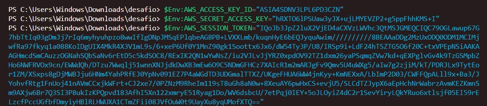
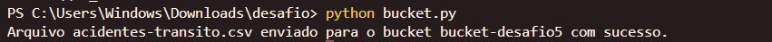
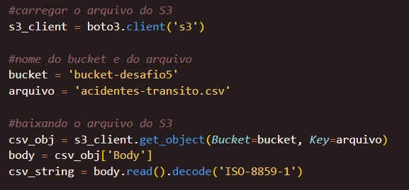
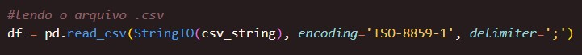
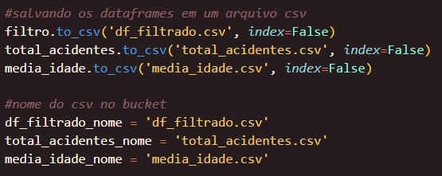
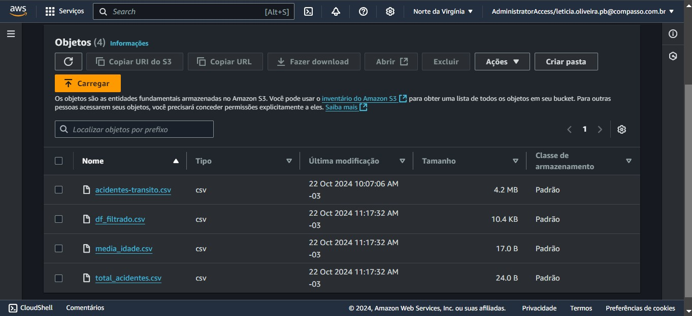
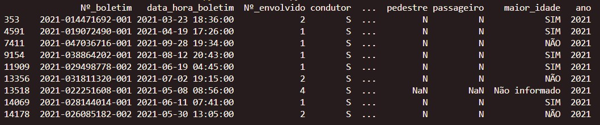
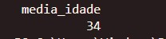
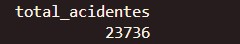

##   Sprint 5 - Desafio 

### Objetivo
O objetivo desse desafio foi criar um bucket no S3 utilizando o boto3 e carregar um conjunto de dados nele.

### Conjunto de dados
O conjunto de dados escolhido foi "Relação das pessoas envolvidas nos acidentes de trânsito com vítima" em 2021, elaborado pela Prefeitura de Belo Horizonte. Ele inclui informações como: 

* Número de envolvidos no acidente
* Data e hora do registro do boletim 
* Descrição da severidade do acidente

### Criação do bucket
Primeiro, importei a biblioteca boto3 e criei um cliente S3 para poder interagir com o serviço. Defini o nome do bucket como 'bucket-desafio5' e criei ele com o comando create_bucket(). Depois, especifiquei o caminho do arquivo CSV local e o nome que ele teria dentro do bucket.

Para configurar a conexão entre o boto3 e o S3, utilizei a access key através do AWS CLI. Primeiro, instalei o AWS CLI no meu sistema e, em seguida, executei o comando aws configure. Depois, defini as variáveis de ambiente.

Para enviar o arquivo, utilizei o recurso upload_file() da biblioteca boto3, que faz o upload direto do arquivo para o bucket. No final, o arquivo foi enviado com sucesso e a mensagem de confirmação foi exibida no terminal.

### Criação do dataframe
Para criar os dataframes, comecei importando as bibliotecas necessárias, incluindo o boto3 para interagir com o S3 e o pandas para manipular os dados.  Também importei o StringIO da biblioteca io, que me ajudou a ler o conteúdo do arquivo CSV que baixei do S3. O StringIO é útil porque transforma a string que contém os dados do CSV em algo que o pandas pode ler como um arquivo.

Em seguida, criei um cliente S3 com o comando boto3.client('s3') e defini o nome do bucket e do arquivo CSV que queria baixar. Usei o método get_object() para pegar o arquivo do S3 e obtive seu conteúdo. Depois, decodei esse conteúdo usando a codificação ISO-8859-1.

Com o conteúdo do CSV em uma string, utilizei o StringIO para criar um objeto que o pandas pudesse ler. Isso me permitiu usar a função pd.read_csv() para ler e transformar os dados em um dataframe.

Depois, fiz algumas transformações e limpeza nos dados, removendo espaços nos nomes das colunas e utilizando algumas funções para obter informações. Com os dados prontos, criei três dataframes diferentes.

Por fim, subi esses arquivos de volta para o bucket no S3 usando o método upload_file() da biblioteca boto3. Após a conclusão do upload, uma mensagem foi exibida no terminal confirmando que tudo tinha sido enviado com sucesso.

O bucket final ficou assim:

### Dataframes

#### Filtrado
Para obter o df_filtrado.csv, fiz as seguintes alterações:

1. **Função Condicional**

Criei uma nova coluna chamada "maior_idade" para indicar se a idade dos envolvidos nos acidentes era maior ou igual a 18 anos.

2. **Função de Conversão**

Converti a coluna "data_hora_boletim" para um formato de data utilizando pd.to_datetime().

3. **Função de Data**

Criei outra coluna chamada "ano" para extrair o ano da coluna data_hora_boletim. Utilizei dt.year para realizar essa extração.

4. **Função de String** 

Ajustei a coluna "pedestre" substituindo o valor "S" por "SIM".

5. **Filtro com dois operadores lógicos**

O primeiro operador lógico utilizado foi o "&", que verifica se a coluna cinto_seguranca é igual a "NÃO", garantindo que apenas acidentes onde o cinto de segurança não foi utilizado sejam selecionados.

Em seguida, usei o operador "&" novamente para checar se a coluna desc_severidade é igual a "FATAL" e se a coluna condutor é igual a "S", filtrando acidentes fatais em que o condutor estava diretamente envolvido. 

No final, o dataframe ficou assim:

#### Média de idade
Para calcular a média de idade dos envolvidos nos acidentes, usei a função de agregação mean(), que faz a média dos valores da coluna "Idade". Depois, apliquei a função round() para arredondar o valor e criei um novo dataframe com esse resultado. O resultado final ficou assim:

#### Total de acidentes
Para obter o número total de acidentes registrados, usei a função de agregação count() na coluna "Nº_boletim". Isso me permitiu contar quantos boletins de ocorrência estão presentes no dataset, criando um novo dataframe com o total de registros. O resultado foi:

### Conclusão
Durante o desafio, aprendi muito sobre como trabalhar com dados usando Python para manipular e analisar essas informações. A experiência me ajudou a entender melhor como organizar e processar dados, além de destacar a importância de filtrar e agrupar informações para conseguir insights significativos.

Consegui aplicar técnicas para fazer análises, identificar padrões e focar em situações específicas. Além disso, achei bem interessante colocar em prática o uso do S3 da AWS, vendo como é fácil armazenar e acessar dados na nuvem. No geral, foi uma ótima oportunidade para melhorar minhas habilidades em análise de dados e programação.

