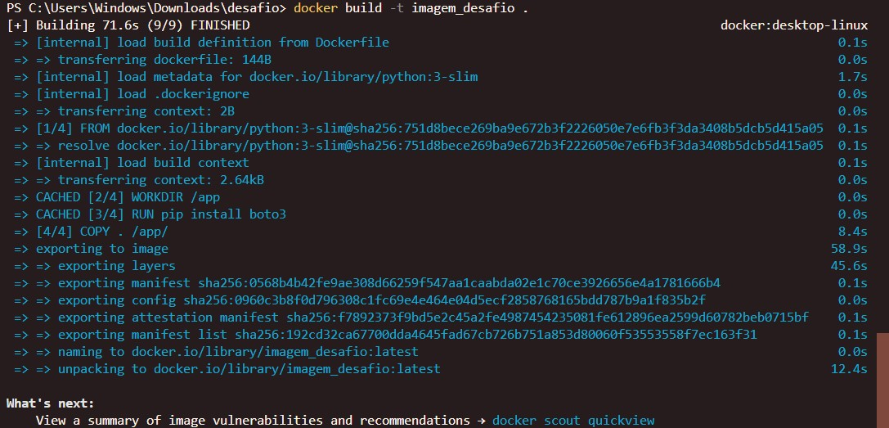

##   Sprint 6 - Desafio 

### Objetivo
O objetivo desse desafio foi enviar os arquivos CSV locais do desafio final para um Bucket Amazon S3 na camada RAW.

### Envio dos dados para o bucket
Para enviar os arquivos para o S3, comecei importando a biblioteca `boto3` para estabelecer a conexão com o S3 e fazer o upload dos arquivos, e `datetime` para manipular e organizar as datas de forma eficiente.

Também importei o arquivo `chaves_aws`, onde estão armazenadas as credenciais de acesso à AWS.

Para configurar a sessão e criar o bucket no S3, iniciei definindo as chaves de acesso e a região usando `boto3.Session`, que foram extraídas das variáveis armazenadas no arquivo `chaves_aws`. Após criar a sessão, configurei o cliente S3 e utilizei a variável `bucket` do mesmo arquivo para definir o nome do bucket. Por fim, utilizei o método `s3.create_bucket()` para criar o bucket no S3. 

Para ler os arquivos CSV, criei a função `ler_csv` que recebe o caminho do arquivo como parâmetro. A função lê o conteúdo do CSV e armazena na variável data. Em seguida, exibe uma mensagem no terminal confirmando que o arquivo foi lido com sucesso. Por fim, retorna os dados lidos para que possam ser utilizados em outras partes do código.

Criei a função `carregar_no_s3` para enviar os dados para o S3, que recebe como parâmetros os dados a serem enviados, o nome do bucket e o nome do arquivo. A função obtém a data atual e a formata em ano, mês e dia para criar um caminho padronizado no S3. Em seguida, usa o `método s3.put_object` para fazer o upload dos dados para o bucket e exibe uma mensagem no terminal confirmando que foi enviado.

Por fim, utilizei a função ler_csv para ler os arquivos `movies.csv` e `series.csv`. Após isso, chamei a função `carregar_no_s3` para enviar os dados para o S3, passando as variáveis que contêm os dados, o nome do bucket e uma string que indica se os dados são de filmes ou séries.

### Configuração e Execução do Container Docker
No Dockerfile, comecei com `FROM python:3-slim` para usar uma imagem leve do Python 3. Depois, configurei o diretório de trabalho com `WORKDIR /app` e instalei o `boto3` com `RUN pip install boto3`. Em seguida, copiei todos os arquivos para o container com `COPY . /app/` e, no final, defini que o script `csvload.py` vai rodar quando o container iniciar com `CMD ["python", "csvload.py"]`.

Depois, criei a imagem usando `docker build -t imagem_desafio .`

Por fim, rodei o container com o comando `docker run imagem_desafio`, e tudo foi enviado com sucesso para o bucket S3.

O bucket final ficou assim:

### Sobre a análise

Nesse desafio, escolhi analisar filmes com o tema "crime" com o objetivo de responder perguntas específicas sobre o desempenho e as características desses filmes. O foco será em filmes lançados entre os anos 90 e 2022.

A ideia é entender melhor o que faz um filme de crime ser bem-sucedido, olhando para fatores como popularidade, avaliações, duração e orçamento. Além disso, quero explorar como o tema evoluiu ao longo dos anos, identificando tendências e padrões.

**Perguntas que serão respondidas**
* Qual é a relação entre a duração dos filmes de crime e a média de suas avaliações?
* Quem são os diretores mais frequentes de filmes de crime e qual é a média de avaliação de seus filmes? 
* Como a relação entre orçamento e receita de filmes de crime variou ao longo dos anos?
* Quais países produzem os filmes de crime com maior receita de bilheteria?
* Qual é a diferença na popularidade de filmes de crime entre produções em inglês e produções em outros idiomas?

