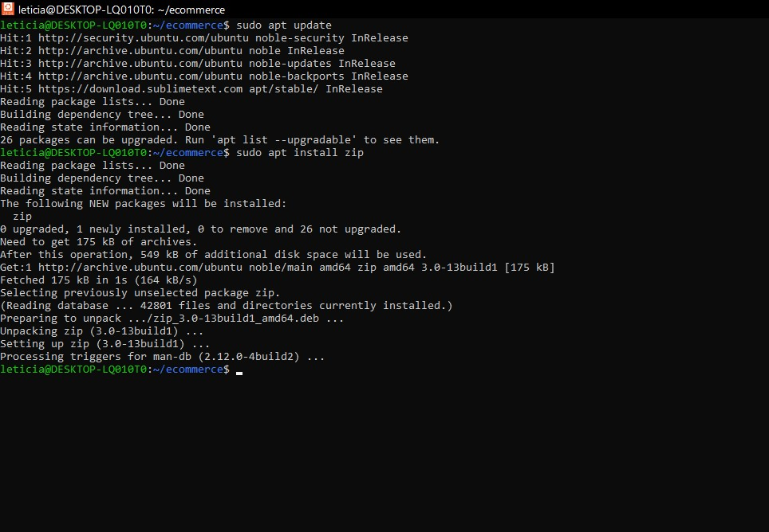
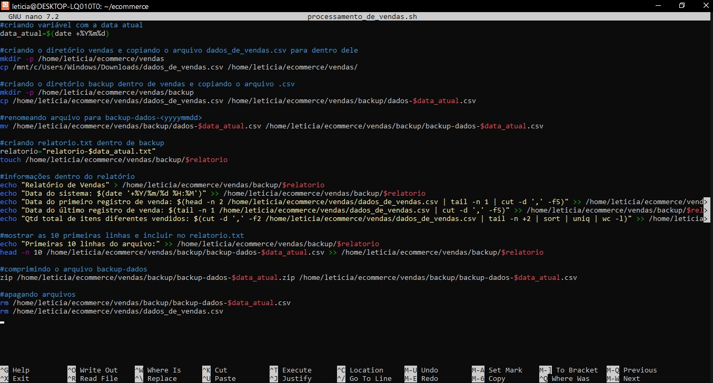
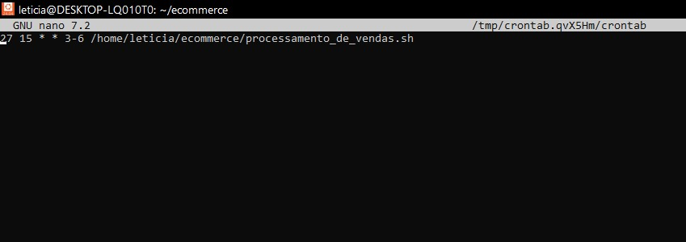

##   Sprint 1 - Desafio 

### Objetivo
 O objetivo do desafio era desenvolver um sistema que processasse e gerasse relaórios de vendas diários. O programa deveria ser feito no terminal do Linux utilizando os comandos aprendidos na Sprint 1 e um banco de dados disponibilizado.

### 1. Configurando o ambiente
 
 Depois de baixar os dados fornecidos, no terminal do Linux, criei o diretório "ecommerce" (mkdir ecommerce), usei o comando "cd ecommerce" para mudar o diretório, depois, utilizando o editor de texto "nano", criei o executável "processamento_de_vendas.sh". 

 ### 2. Criando o executável
 
 
 Dentro de "processamento_de_vendas.sh" criei novos diretórios ("vendas", "backup"), copiei os dados para dentro deles e renomeei arquivos. Utilizei comandos como "cp" para copiar arquivos, "zip" para compactar arquivos,  entre outros.  

 
 Iniciei a criação do relatório utilizando comandos como "echo" para exibir as linhas de texto no terminal, "head" e "tail" para pegar linhas específicas do banco de dados, "cut" para colunas específicas, entre outros. 

 
Baixei o comando "zip" que compacta arquivos conforme a imagem abaixo:

 

  
Exclui arquivos utilizando o comando "rm". Ao final, o executável ficou assim:

  

  ### 3. Agendamento 
  
Para executar o script por 4 dias às 15h27 criei um agendamento utilizando o comando "crontab -e". Coloquei a hora e os dias e o caminho do executável. Dei as permissões necessárias para que o comando funcionasse.

   

  ### 4. Relatório final
  
Também utilizando o editor de texto "nano", criei o executável "consolidador_de_processamento_de_vendas". Nele, utilizei o comando "cat" para unir todos os relatórios gerados ao relatório final e ">>" para adicionar os arquivos, e não sobrescrever.

   

### 5. Conclusão

Ao final, foram gerados 4 relatórios de vendas com dados diferentes, uma vez que diariamente adicionei novos produtos no arquivo .csv.

 