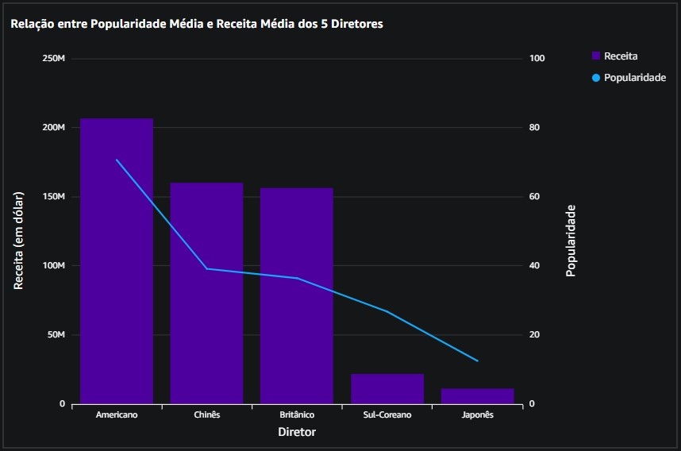

##   Sprint 10 - Desafio 

### Objetivo
O objetivo desse desafio foi desenvolver um dashboard utilizando o Amazon QuickSight, baseado nos dados previamente ingeridos e tratados.

### Importando os dados
Primeiro, comecei importando os dados utilizando o Athena como datasource.

Após importar os dados, criei relacionamentos entre as tabelas para garantir consistência nas análises e facilitar o cruzamento de informações.

### Análise
O objetivo da minha análise foi comparar o sucesso de diretores de diferentes nacionalidades entre os anos 1990 e 2009, utilizando métricas como faturamento, popularidade e orçamento.

Escolhi um diretor representativo de cada nacionalidade, todos amplamente reconhecidos mundialmente. São eles:

 * **David Fincher**: Americano
 * **Ridley Scott**: Britânico
 * **Bong Joon-Ho**: Sul-Coreano
 * **John Woo**: Chinês
 * **Takashi Miike**: Japonês

Para simplificar o entendimento de quem visualiza o dashboard, optei por exibir gentílicos nos gráficos em vez de nomes, criando um campo calculado que mapeia os diretores para suas respectivas nacionalidades.

### Visualização de Dados

#### 1. Cards
Iniciei o dashboard com a criação de cards que oferecem uma visão geral da amostra de dados, destacando o número de diretores e filmes analisados, além do gênero escolhido.

#### 2. Mapa de árvore
Esse gráfico mostra a **nota média por diretor**, facilitando a comparação do desempenho crítico entre eles.

* O diretor Americano apresenta a maior nota média (8,15), seguido pelo Britânico (7,6).

* Diretores Sul-Coreano, Japonês e Chinês completam a sequência com notas decrescentes.

#### 3. Nuvem de Palavras
Para ilustrar a **popularidade média** dos diretores, utilizei uma nuvem de palavras onde o tamanho do texto reflete o grau de popularidade.

* O diretor **Americano** é o mais popular, enquanto o **Japonês** apresenta a menor popularidade.

#### 4. Gráfico de Combinação de Barras Clusterizadas com Linha
Esse gráfico combina barras para **receita** e uma linha para **popularidade**, evidenciando a relação entre essas variáveis

* O diretor **Americano** domina em receita (acima de $200M), seguido por **Chinês** e **Britânico** (acima de $100M).

#### 5. Gráfico de Pizza
Comparando diretores de países de língua inglesa com diretores asiáticos, o gráfico de pizza mostra que:

* Diretores que falam **inglês** geraram $173.97M em receita, enquanto diretores **asiáticos** contribuíram com $16.31M.

Para esse gráfico, criei um campo calculado que agrupa os dois diretores que falam inglês em uma categoria e os três diretores asiáticos em outra.

#### 6. Gráfico de Barras Horizontais
Exibe a receita total de cada diretor, com destaque para o diretor **Americano**, que lidera, seguido pelo **Chinês** e **Britânico**.

#### 7. Gráfico de Linhas de Área
Mostra a média de orçamento por diretor:

* O diretor **Americano** tem o maior orçamento médio (acima de $60M), seguido pelo **Britânico** (acima de $40M).

O dashboard final ficou assim:

### Conclusão
O dashboard revela que diretores que falam inglês, especialmente o Americano, se destacam com um desempenho bem superior, tanto em notas médias quanto em popularidade e receitas.

* O diretor **Americano** alcançou a maior nota média (8,15) e liderou em receita (acima de $200M), destacando-se no mercado global.

* Diretores **asiáticos**, embora mostrem qualidade, apresentam desempenho mais limitado, reforçando que falar inglês e alcançar mercados ocidentais é um diferencial significativo para o sucesso comercial.
