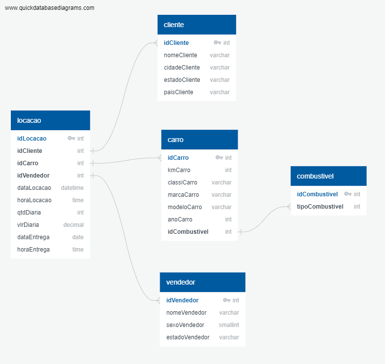
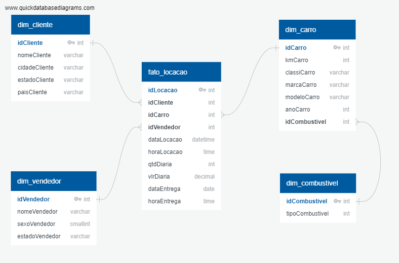

##   Sprint 2 - Desafio 

### Objetivo
O objetivo do desafio era normalizar o banco de dados concessionaria.sqlite e depois transformar o modelo relacional em modelo dimensional.

### 1. Normalização

 A tabela tb_locacao já estava em Primeira Forma Normal (1NF) porque os valores em cada coluna eram atômicos, ou seja, não podiam ser divididos em partes menores sem perder o seu significado. Além disso, cada coluna armazenava um tipo de dado, e a tabela tinha uma chave primária (idLocacao) que identificava de forma única cada linha.

Para atender à Segunda Forma Normal (2NF), dividi a tabela tb_locacao em várias tabelas. Em cada nova tabela, estabeleci uma chave primária, pois, na 2nf, todas as colunas não-chave devem depender totalmente da chave primária.

Ao final, a base de dados estava na Terceira Forma Normal (3NF) porque não existiam dependências transitivas em nenhuma das tabelas, ou seja, todas as colunas não-chave dependiam exclusivamente das colunas-chave. Essa estrutura garantiu que a base de dados estivesse completamente normalizada. 

 

 ### 2. Dimensionamento 
 
 Para criar o modelo dimensional, criei a tabela de fatos (fato_locacao), que contém apenas as medidas quantitativas, e as tabelas de dimensão, que fornecem detalhes adicionais sobre essas medidas. Nesse modelo, associei a tabela fatos às tabelas dimensão por meio de chaves estrangeiras. Centralizei a tabela de fatos e coloquei as tabelas de dimensões ao seu redor, seguindo a representação do Star Schema

  

