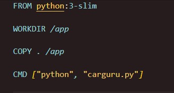
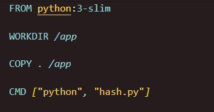

##   Sprint 4 - Desafio 

### Objetivo
O objetivo desse desafio foi criar imagens e containers que executassem arquivos .py.

### Criação do Dockerfile
Em ambos os scripts (carguru e hash), utilizei as seguintes instruções:

* FROM: especifica a imagem base. Nesse caso, utilizei s versão 3 do python em sua variante "slim", que é mais leve que a versão padrão
* WORKDIR: define o diretório de trabalho dentro do container.
* COPY: copia arquivos do sistema local para o container.
* CMD: define o comando a ser executado quando o container é iniciado.

A única diferença entre os Dockerfiles criados foi o comando no "CMD", que especifica o arquivo a ser executado: "carguru.py" e "hash.py".

Carguru/Hash
 

### Carguru

