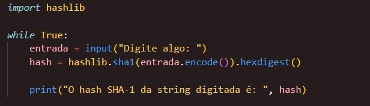
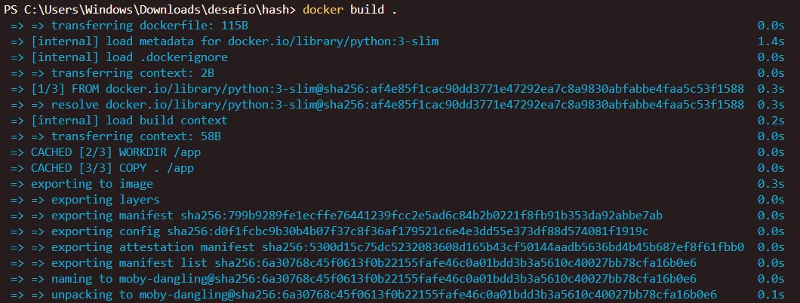
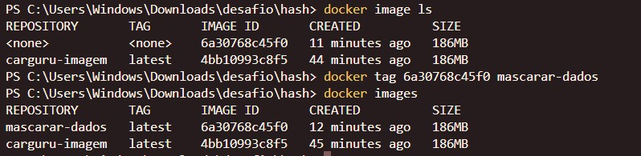
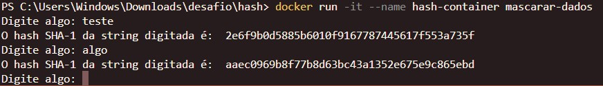

##   Sprint 4 - Desafio 

### Objetivo
O objetivo desse desafio foi criar imagens e containers que executassem arquivos .py.

### Criação do Dockerfile
Para criar o arquvio de instruções Dockerfile, utilizei as seguintes instruções em ambos os scripts (carguru e hash):

* FROM: especifica a imagem base. Nesse caso, utilizei a versão 3 do python em sua variante "slim", que é mais leve que a versão padrão
* WORKDIR: define o diretório de trabalho dentro do container.
* COPY: copia arquivos do sistema local para o container.
* CMD: define o comando a ser executado quando o container é iniciado.

A única diferença entre os Dockerfiles criados foi o comando no "CMD", que especifica o arquivo a ser executado: "carguru.py" e "hash.py".

Dockerfile de "carguru.py"

Dockerfile de "hash.py"

### Carguru

Depois de criar o Dockerfile, utilizei o comando "docker build ." para construir a imagem.

Após a imagem ser contruída, renomeei ela usando "docker tag `<imagem_id>` carguru-imagem" 

Por fim, nomeei e executei o container com o comando "docker run --name carguru-container carguru-imagem", e o resultado foi exibido em seguida.

### Hash

Nesse caso, foi necessário criar um arquivo Python que gerasse o hash de uma string fornecida pelo usuário. Para isso, importei a biblioteca hashlib e implementei um loop contínuo:

Seguindo a mesma lógica para o script "hash", após criar o Dockerfile, utilizei "docker build ." para construir a imagem.

Após a construção, também renomeei a imagem usando "docker tag `<imagem_id>` hash-imagem".

Em seguida, nomeei e executei o container com o comando "docker run -it --name hash-container mascarar-dados", utilizando "-it" para permitir a interação com o container interativo. O hash SHA-1 das strings digitadas foi gerado e exibido conforme esperado.

### É possível reutilizar containers?
Sim, é possível reutilizar containers utilizando o comando "docker start <container_id>"

