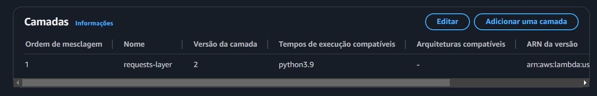
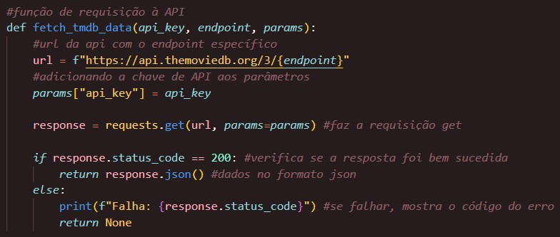
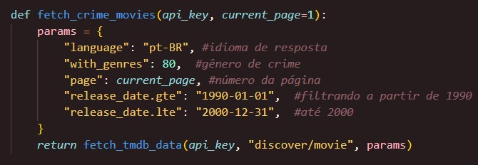
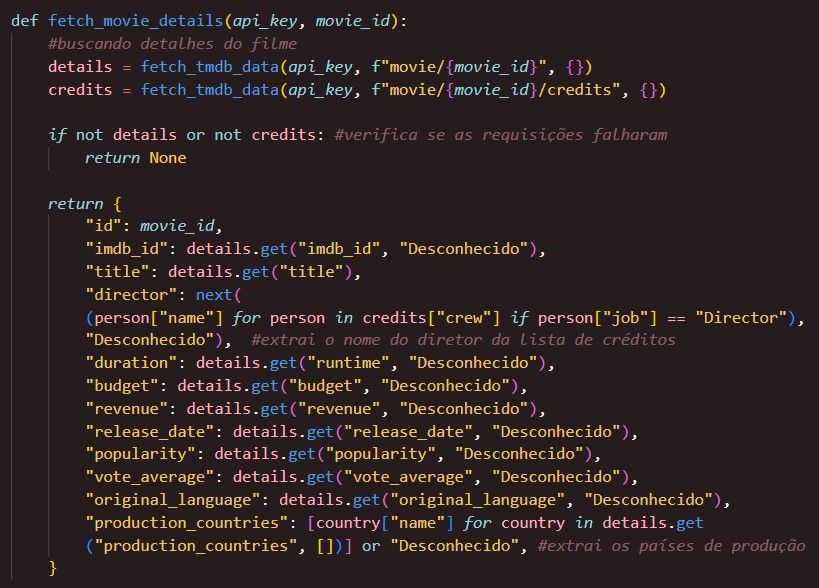
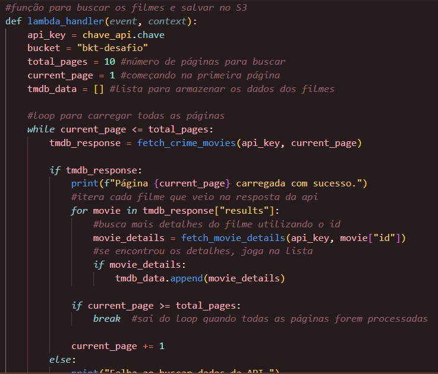
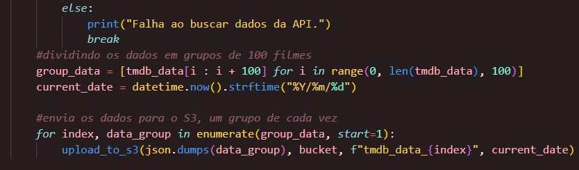
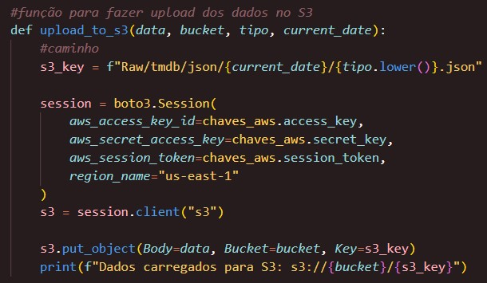
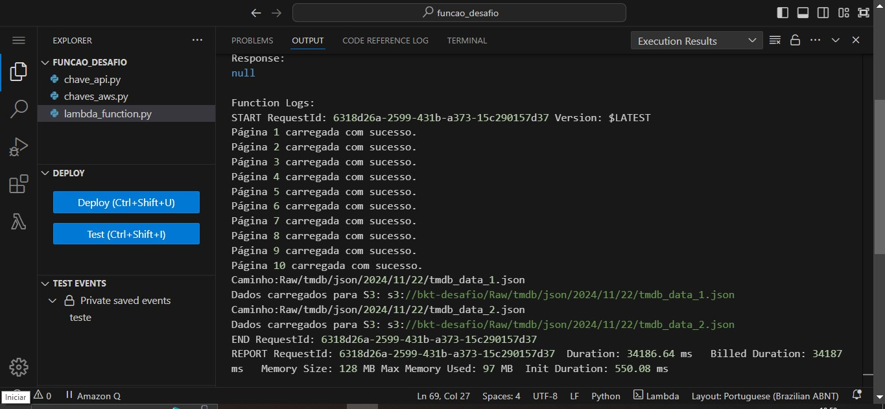
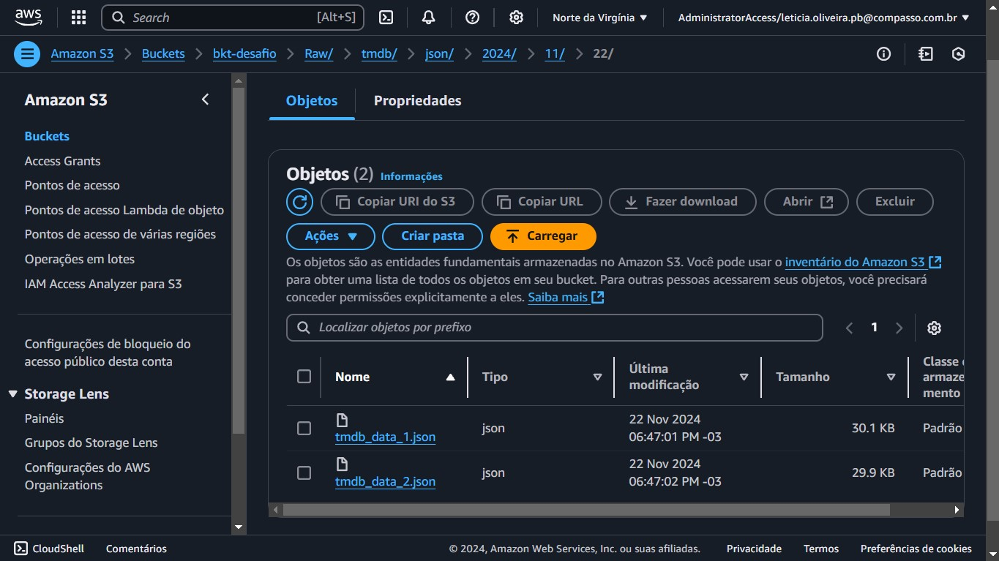

##   Sprint 7 - Desafio 

### Objetivo
O objetivo deste desafio foi utilizar o AWS Lambda para fazer requisições à API do TMDB e enviar os dados obtidos diretamente para um bucket no S3.

### Função Lambda e camada request
Comecei criando uma função Lambda na AWS:

Para conseguir fazer as requisições às APIs no AWS Lambda, precisei instalar a biblioteca requests no meu ambiente local, já que ela não vem integrada no serviço. Depois disso, criei uma camada personalizada no Lambda para incluir essa biblioteca, permitindo que o código consiga enviar e receber dados das APIs. 

No código, comecei importando as bibliotecas necessárias, incluindo `boto3` para interação com o S3, `requests` para fazer as chamadas na API do TMDB e `datetime` para manipulação de datas Também criei dois arquivos separados por questão de segurança: `chave_api` e `chaves_aws`, para guardar a chave da API do TMDB e as credenciais da AWS.

Criei a função `fetch_tmdb_data` que faz as requisições para API. Ela recebe o endpoint, como o `discover/movie`, os parâmetros, como idioma e gênero, e a chave da API. A função monta a URL, faz a requisição, e se der tudo certo (status 200), retorna os dados da API em formato JSON. Caso contrário, ele mostra uma mensagem apontando o erro.

Depois, criei a função `fetch_crime_movies`, que configura os parâmetros necessários para buscar exclusivamente filmes do gênero crime (identificado pelo código 80). A função também define o idioma dos dados como português, aplica um filtro de datas de lançamento entre 1990 e 2000, e inclui um controle de paginação para facilitar o acesso a vários filmes de uma vez. Essa função usa a `fetch_tmdb_data` pra puxar os dados.

Também desenvolvi a função `fetch_movie_details` para obter informações específicas de cada filme necessárias para minha análise. Ela faz duas requisições: uma para detalhes gerais do filme (título, orçamento) e outra para os créditos (nesse caso, o diretor). Além disso, ela lista os países de produção e substitui qualquer dado que esteja faltando por "Desconhecido".

Fiz a função `lambda_handler`, que é a parte principal do código. Ela começa definindo o número total de páginas a serem processadas e o valor inicial da página. Em seguida, entra em um loop onde chama a função `fetch_crime_movies` para buscar filmes de crime de cada página. Após obter os filmes de uma página, ela utiliza a função `fetch_movie_details` para buscar informações adicionais sobre cada filme.

Todos os dados obtidos são armazenados em uma lista, que é dividida em grupos de até 100 filmes. Ao final, esses grupos são enviados para o S3 usando a função `upload_to_s3`, onde cada grupo de dados é transformado em um arquivo JSON e enviado para o bucket de armazenamento.

Por fim, a função `upload_to_s3` envia os dados para o bucket no S3. Ela configura uma sessão com as credenciais da AWS armazenadas no arquivo `chaves_aws`, define o caminho do arquivo no S3 e utiliza o método `put_object` do cliente S3 para enviar os dados no formato JSON. Ao final, uma mensagem confirma o sucesso do upload, indicando o caminho completo no S3.

### Executando
Fiz um evento de teste e executei a função Lambda, que foi bem-sucedida. A função respondeu conforme esperado, processando os dados e realizando o upload para o S3 sem erros.

O bucket final ficou com a seguinte estrutura:

### Sobre a análise
Durante o desenvolvimento desse desafio, decidi focar em uma análise mais específica, comparando a nacionalidade dos diretores e os países de produção com o sucesso dos filmes. Para essa comparação, vou usar métricas como faturamento e popularidade. Essa abordagem me permitirá entender melhor como esses fatores influenciam o desempenho dos filmes.