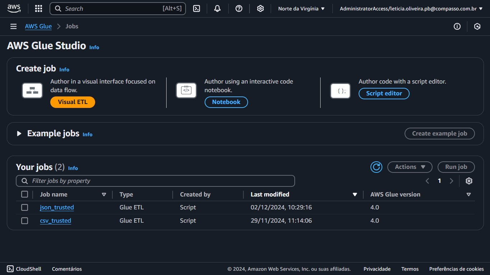
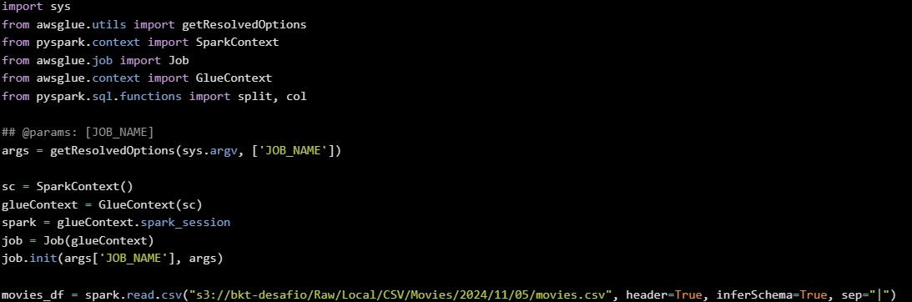
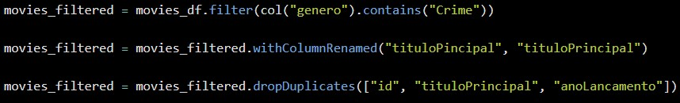
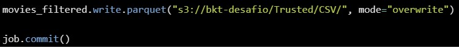
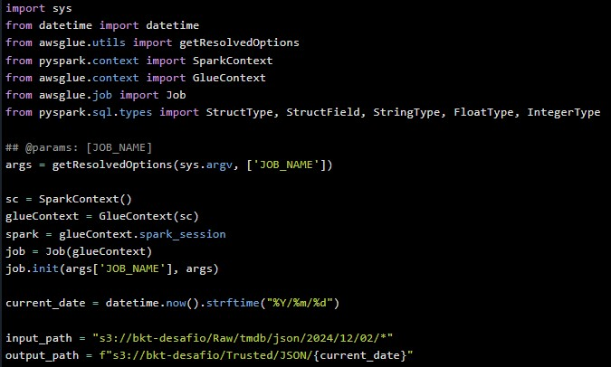
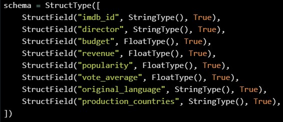
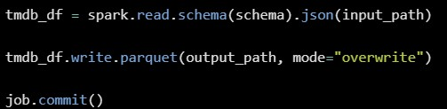
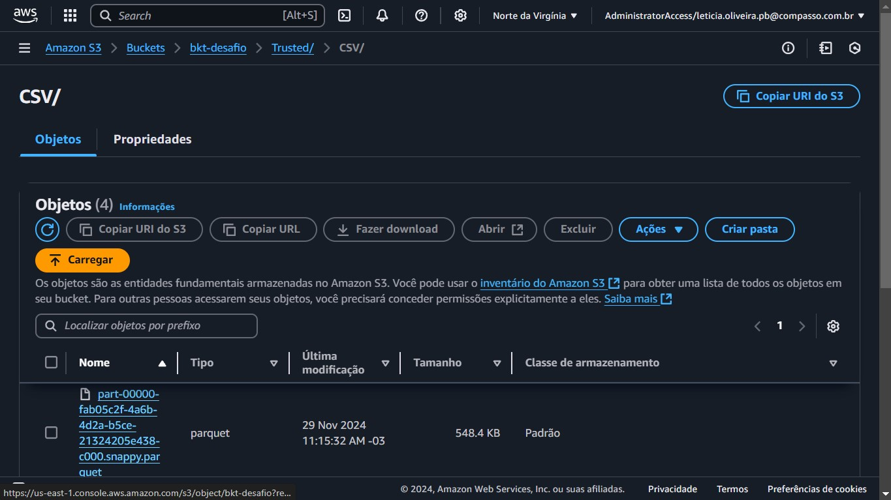
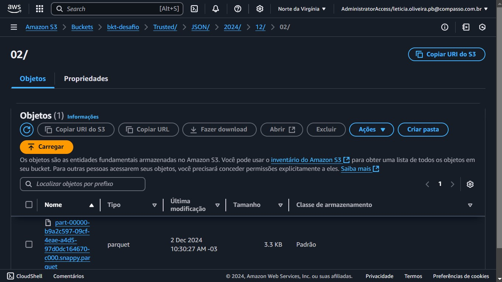

##   Sprint 8 - Desafio 

### Objetivo
O objetivo desse desafio foi organizar os dados de um data lake na camada Trusted. Nessa etapa, os dados são limpos e confiáveis, vindo da camada Raw. Utilizando AWS Glue com Apache Spark, os dados deveriam ser movidos para a Trusted Zone e armazenados de forma padronizada em Parquet no S3.

### Criação de Jobs
Comecei criando um job para processar arquivos CSV e outro para JSON.

### CSV
Primeiro, importei as bibliotecas necessárias e defini uma variável para ler o arquivo CSV dentro do bucket S3. Usei o método `spark.read.csv` e configurei para considerar o cabeçalho e usar `|` como separador de colunas.

Depois, apliquei um filtro para selecionar apenas os filmes em que o gênero contém a palavra "Crime". Para isso, usei a função `filter` junto com `col`. Também renomeei a coluna `tituloPincipal` para `tituloPrincipal`, corrigindo um erro de escrita no arquivo original.

Além disso, removi as duplicatas no DataFrame, garantindo que não houvesse registros repetidos com base no `id`, `tituloPrincipal` e `anoLancamento`.

Por fim, gravei o DataFrame no formato Parquet em uma nova pasta do S3. Deixei configurado para substituir os arquivos antigos, garantindo que apenas dados atualizados permaneçam. Finalizei o job com `job.commit()`, garantindo que o processamento fosse concluído com sucesso.

### JSON
Também comecei importando as bibliotecas necessárias, defini o caminho de entrada para os arquivos JSON no bucket S3 e criei uma variável com a data atual para organizar os dados de saída.

Em seguida, criei um schema personalizado para organizar o dados JSON, garantindo que as colunas fossem lidas corretamente, como `imdb_id` e `director` como strings, e campos numéricos como `budget` e `revenue` como floats.

Depois, li os arquivos JSON do bucket usando o schema configurado, garantindo que os dados fossem carregados de forma estruturada e sem erros. Logo depois, salvei o DataFrame resultante no formato Parquet em um novo caminho no S3, incluindo a data no caminho de saída. Configurei para sobrescrever arquivos antigos, deixando apenas os dados mais recentes disponíveis.

Por fim, finalizei o processo com `job.commit()` para concluir o job e garantir que o Glue registrasse o job como concluído com sucesso.

### Camada Trusted no bucket
Ao final, os arquivos ficaram organizados da seguinte maneira:

**CSV**

**JSON**

### Sobre a análise
Durante o desenvolvimento desta etapa, decidi revisitar o desafio da Sprint 7, selecionando diretores específicos para aprofundar a análise. Continuarei considerando métricas como faturamento e popularidade para realizar comparações mais detalhadas.