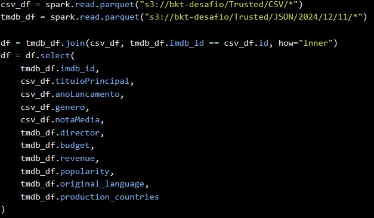
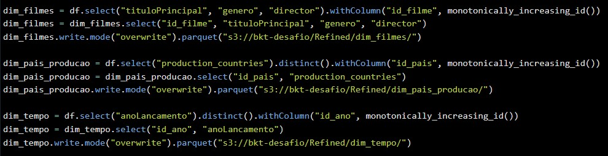
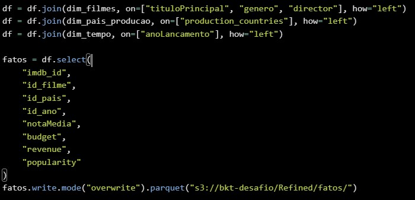
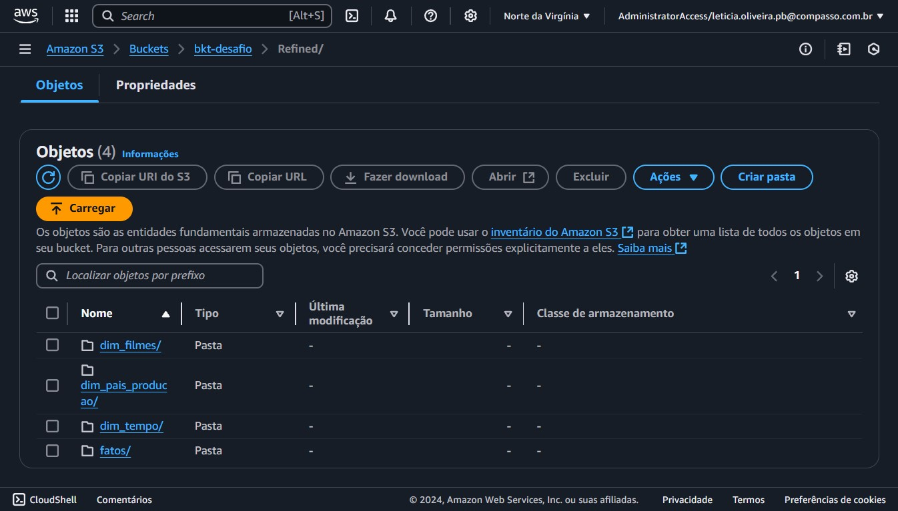
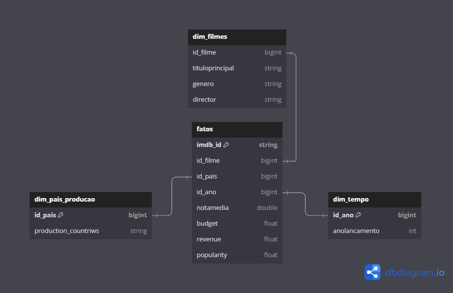

##   Sprint 9 - Desafio 

### Objetivo
O objetivo desse desafio foi modelar e dimensionar os dados provenientes da camada Trusted, organizando-os em um modelo dimensional, e, em seguida, enviá-los para a camada Refined no formato Parquet.

### Unindo arquivos
Primeiro, comecei criando um job no AWS Glue. Dentro do job, defini variáveis para os caminhos dos arquivos CSV e JSON localizados na camada Trusted.

Depois disso, realizei a união dos dois arquivos utilizando o `id` em comum como chave de ligação. Para isso, usei um `inner join`, garantindo que apenas os registros presentes em ambos os arquivos fossem combinados. Em seguida, selecionei as colunas relevantes para criar um novo DataFrame apenas com os dados necessários para minha análise.

### Modelagem dimensional
Para o dimensionamento, defini as variáveis e selecionei as colunas que seriam incluídas em cada dimensão. Utilizei a função `monotonically_increasing_id()` para gerar IDs automaticamente. Após isso, reordenei as colunas, garantindo que o ID fosse a primeira coluna. Por fim, enviei as dimensões para a camada Refined no bucket, concluindo o processo de modelagem.

Para adicionar os IDs gerados nas dimensões ao DataFrame principal, fiz a junção das tabelas dimensionais com o DataFrame. Depois disso, criei a tabela `fatos` selecionando as colunas necessárias e incluindo os IDs das dimensões. Ao final, salvei a tabela no bucket S3.

### Estrutura do bucket

O bucket foi estruturado da seguinte forma:

### Modelo de dados

